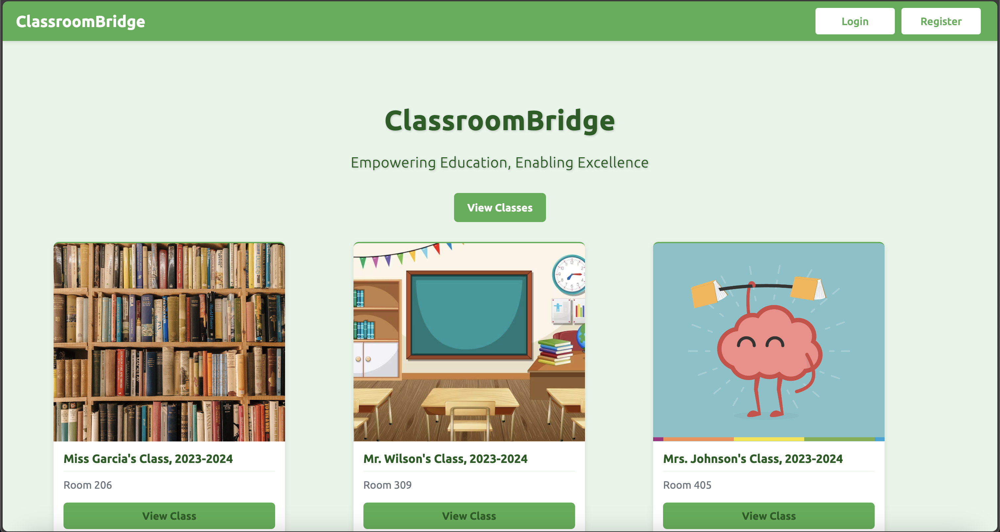
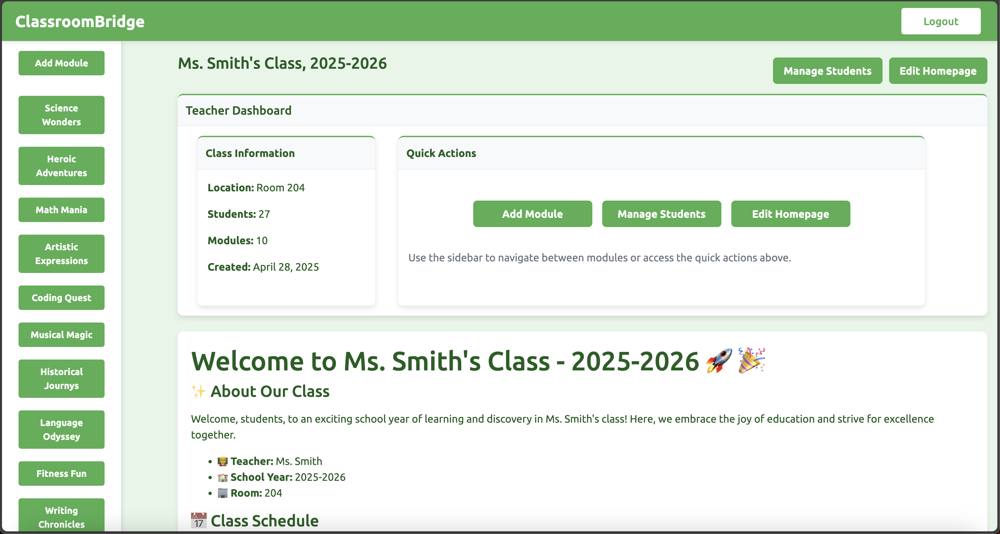

# ClassroomBridge

A comprehensive Learning Management System built with Django that streamlines online education delivery for both educators and students.




## Features

- **User Management**: Robust authentication system with distinct teacher and student roles
- **Course Management**: Intuitive interface for creating and organizing educational content
- **Module System**: Structured content delivery with rich Markdown formatting support
- **Student Enrollment**: Simplified management of student access to specific courses
- **Customizable Homepages**: Teachers can personalize course landing pages for better engagement
- **Responsive Design**: Optimized viewing experience across desktop and mobile devices

## Technology Stack

- **Backend**: Python 3.x, Django web framework
- **Frontend**: HTML5, CSS3, JavaScript with responsive design principles
- **Database**: Django ORM with SQLite (configurable for PostgreSQL/MySQL in production)
- **Content Rendering**: markdown2 library for rich content creation
- **Security**: Django's built-in protection against CSRF, XSS, and SQL injection

## Getting Started

### Requirements

- Python 3.8+
- Django 3.2+
- markdown2 library
- Modern web browser (Chrome, Firefox, Safari, Edge)

### Installation

1. Clone the repository
2. Create a virtual environment:
   ```bash
   python -m venv venv
   source venv/bin/activate  # On Windows: venv\Scripts\activate
   ```
3. Install dependencies:
   ```bash
   pip install -r requirements.txt
   ```
4. Set up the database:
   ```bash
   python manage.py migrate
   ```
5. Create an admin user:
   ```bash
   python manage.py createsuperuser
   ```
6. Start the development server:
   ```bash
   python manage.py runserver
   ```
7. Access the application at http://localhost:8000

## System Architecture

ClassroomBridge follows Django's MVT (Model-View-Template) architecture with a focus on maintainability and scalability:

| Component | Description | Implementation Details |
|-----------|-------------|------------------------|
| **Models** | Define data structures | Custom User model, Course and Module models with appropriate relationships |
| **Views** | Business logic | Function-based views with clear separation of concerns |
| **Templates** | User interface | Hierarchical template structure with a base layout for consistent UX |
| **URLs** | Request routing | Logical URL patterns reflecting resource hierarchy |
| **Forms** | Data validation | Form-based validation ensuring data integrity |
| **Static Assets** | UI resources | Organized CSS/JS structure for sustainable frontend maintenance |

### Data Model Relationships

```
User (Teacher) 1──────*─┐
                        │
                        v
                      Course 1─────*─┐
                        │            │
                        │            v
                        *            Module
                        │
                      User (Student)
```

## User Experience

### For Teachers

- **Class Creation**: Establish new virtual classrooms with customizable settings
- **Content Management**: Build and organize educational modules with rich media support
- **Student Administration**: Easily add and manage student access to specific courses
- **Homepage Customization**: Create engaging landing pages with important class information
- **Visual Customization**: Upload class pictures to personalize the learning environment

### For Students

- **Course Dashboard**: View all enrolled classes in a centralized interface
- **Content Access**: Navigate through structured learning materials
- **Responsive Experience**: Access course content from any device with a consistent experience

## Content Creation with Markdown

ClassroomBridge empowers educators with Markdown for rich content creation:

```markdown
# Module Title

## Learning Objectives
- Understand key concepts
- Apply knowledge to problems
- Analyze results effectively

## Main Content

This is a paragraph with **bold text** and *italic text*.

> **Important Note:** This highlights critical information for students.

### Code Example
```python
def calculate_average(numbers):
    """Calculate the average of a list of numbers."""
    return sum(numbers) / len(numbers)
```

### Table of Information

| Concept | Definition | Example |
|---------|------------|---------|
| Variable | A storage location | x = 5 |
| Function | A reusable block of code | def greet(): |
| Loop | Repeated execution | for i in range(10): |


## Security

The application implements several security measures:

- Django's authentication system with secure password hashing
- CSRF protection for all form submissions
- Login required decorators for securing protected views
- Form validation to prevent malicious data entry
- Template escaping to prevent XSS attacks

## Testing

The application includes a comprehensive test suite:

```bash
# Run all tests
./runtests.sh

# Run specific test modules
python manage.py test Bridge.tests
```