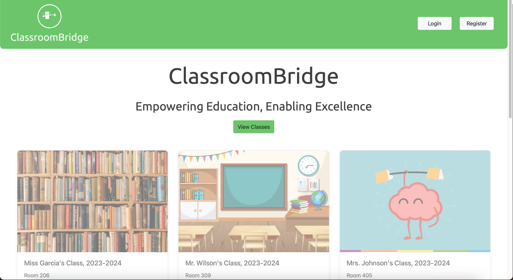

# ClassroomBridge: Comprehensive Learning Management System

## Table of Contents

1. [Introduction](#1-introduction)
2. [System Overview](#2-system-overview)
   - 2.1 [Key Components](#21-key-components)
   - 2.2 [Technology Stack](#22-technology-stack)
3. [Sample](#3-sample)
4. [Getting Started](#4-getting-started)
   - 4.1 [System Requirements](#41-system-requirements)
   - 4.2 [Installation Process](#42-installation-process)
   - 4.3 [Configuration](#43-configuration)
5. [User Roles and Permissions](#5-user-roles-and-permissions)
6. [Feature Guide](#6-feature-guide)
   - 6.1 [For Teachers](#61-for-teachers)
      - 6.1.1 [Creating a New Class](#611-creating-a-new-class)
      - 6.1.2 [Adding Modules](#612-adding-modules)
      - 6.1.3 [Student Management](#613-student-management)
      - 6.1.4 [Editing Class Homepage](#614-editing-class-homepage)
   - 6.2 [For Students](#62-for-students)
      - 6.2.1 [Enrolling in a Class](#621-enrolling-in-a-class)
      - 6.2.2 [Accessing Course Content](#622-accessing-course-content)
7. [System Architecture](#7-system-architecture)
   - 7.1 [Models](#71-models)
   - 7.2 [Views](#72-views)
   - 7.3 [URLs](#73-urls)
   - 7.4 [Frontend Interactivity](#74-frontend-interactivity)
   - 7.5 [Data Flow](#75-data-flow)
8. [Security Measures](#8-security-measures)
   - 8.1 [Authentication](#81-authentication)
   - 8.2 [CSRF Protection](#82-csrf-protection)
   - 8.3 [Login Required](#83-login-required)
   - 8.4 [Data Validation](#84-data-validation)
9. [Content Rendering](#9-content-rendering)
10. [Best Practices for Users](#10-best-practices-for-users)
    - 10.1 [For Teachers](#101-for-teachers)
    - 10.2 [For Students](#102-for-students)
11. [Troubleshooting](#11-troubleshooting)
12. [Performance Considerations](#12-performance-considerations)
13. [Future Development](#13-future-development)
14. [API Reference](#14-api-reference)
15. [Glossary](#15-glossary)
16. [Conclusion](#16-conclusion)

## 1. Introduction

ClassroomBridge is a robust Learning Management System (LMS) designed to facilitate online education in K-12 environments. This comprehensive documentation provides detailed information on the system's features, architecture, setup process, and usage guidelines for educators, students, and system administrators.

Developed using the Django web framework, ClassroomBridge offers a scalable and maintainable platform for managing educational content, user interactions, and course administration. Its intuitive interface and powerful backend make it an ideal solution for schools transitioning to or enhancing their online learning capabilities.

## 2. System Overview

ClassroomBridge is built on a Model-View-Template (MVT) architecture, leveraging Django's robust framework to provide a seamless educational experience.

### 2.1 Key Components

- **User Management**: Handles authentication, authorization, and user profiles for both teachers and students.
- **Course Management**: Facilitates the creation, organization, and administration of classes.
- **Module System**: Enables the structuring of educational content into digestible units, supporting rich text formatting through Markdown.
- **Student Engagement**: Provides tools for adding students to courses and accessing course content.

### 2.2 Technology Stack

- **Backend**: Python 3.x, Django web framework
- **Database**: Django ORM (compatible with various database backends, e.g., SQLite, PostgreSQL)
- **Frontend**: HTML, CSS, JavaScript
- **Content Rendering**: markdown2 library for Markdown to HTML conversion

## 3. Sample




## 4. Getting Started

### 4.1 System Requirements

- Python (version compatible with Django, preferably 3.8+)
- Django web framework (3.2+ recommended)
- markdown2 library
- A modern web browser (Chrome, Firefox, Safari, or Edge)
- Git (for version control and installation)

### 4.2 Installation Process

1. Clone the ClassroomBridge repository:
   ```
   git clone https://github.com/yourusername/classroombridge.git
   ```

2. Navigate to the project directory:
   ```
   cd classroombridge
   ```

3. Create and activate a virtual environment (optional but recommended):
   ```
   python -m venv venv
   source venv/bin/activate  # On Windows, use `venv\Scripts\activate`
   ```

4. Install dependencies:
   ```
   pip install -r requirements.txt
   ```

5. Set up the database:
   ```
   python manage.py migrate
   ```

6. Create a superuser account:
   ```
   python manage.py createsuperuser
   ```

7. Start the development server:
   ```
   python manage.py runserver
   ```

8. Access the application at `http://localhost:8000`

### 4.3 Configuration

1. Open `settings.py` in your preferred text editor.
2. Configure the database settings if you're not using the default SQLite:
   ```python
   DATABASES = {
       'default': {
           'ENGINE': 'django.db.backends.postgresql',
           'NAME': 'your_database_name',
           'USER': 'your_database_user',
           'PASSWORD': 'your_database_password',
           'HOST': 'localhost',
           'PORT': '5432',
       }
   }
   ```
3. Set the `SECRET_KEY` to a secure random string.
4. Configure email settings for password reset functionality:
   ```python
   EMAIL_BACKEND = 'django.core.mail.backends.smtp.EmailBackend'
   EMAIL_HOST = 'your_smtp_server'
   EMAIL_PORT = 587
   EMAIL_USE_TLS = True
   EMAIL_HOST_USER = 'your_email@example.com'
   EMAIL_HOST_PASSWORD = 'your_email_password'
   ```

## 5. User Roles and Permissions

ClassroomBridge implements a role-based system with two primary user types:

1. **Teachers**:
   - Create and manage courses
   - Add and remove students from courses
   - Create and edit modules within courses
   - Edit class homepages
   - View all content within their courses

2. **Students**:
   - Enroll in courses (via teacher invitation)
   - View course content and modules
   - Cannot create or edit courses or modules

The system uses Django's built-in authentication system, extended with a custom User model to allow for future expansions of user capabilities.

## 6. Feature Guide

### 6.1 For Teachers

#### 6.1.1 Creating a New Class

1. Log in to your teacher account.
2. From the dashboard, click the "New Class" button.
3. Fill in the class details:
   - Class Name (required)
   - Location (required)
   - Background Image URL (optional)
4. Click "Create Class" to finalize.

The system will create a new Course object and associate it with your user account.

#### 6.1.2 Adding Modules

1. Navigate to the desired class from your dashboard.
2. Click the "Add Module" button.
3. Provide module details:
   - Title (required)
   - Description (optional, supports Markdown)
   - Content (required, supports Markdown)
4. Click "Save Module" to publish.

The new module will be associated with the current course and become visible to enrolled students.

#### 6.1.3 Student Management

1. From the class view, click the "Add Student" button.
2. Enter the student's username in the provided form.
3. Click "Add Student" to enroll them in the class.

The system will add the student to the course's `students` ManyToMany field, granting them access to the course content.

#### 6.1.4 Editing Class Homepage

1. From the class view, click the "Edit Homepage" button.
2. Use the provided text area to edit the home content.
   - The content supports Markdown for rich text formatting.
3. Click "Save" to update the homepage.

The system will update the `home_content` field of the Course model and render the new content for all users.

### 6.2 For Students

#### 6.2.1 Enrolling in a Class

Students are enrolled by their teachers. Once enrolled:
1. The class will appear in the student's dashboard.
2. Students can access all published modules and the class homepage.

#### 6.2.2 Accessing Course Content

1. From the dashboard, select the enrolled class.
2. The class homepage will display, showing any content the teacher has added.
3. Navigate through modules using the provided links or menu.
4. Click on individual modules to view their content.

All content is rendered from Markdown to HTML for easy reading.

## 7. System Architecture

### 7.1 Models

ClassroomBridge uses the following key models:

```python
from django.db import models
from django.contrib.auth.models import AbstractUser

class User(AbstractUser):
    pass

class Course(models.Model):
    class_name = models.CharField(max_length=100)
    teacher = models.ForeignKey(User, on_delete=models.CASCADE, related_name='taught_classes')
    location = models.CharField(max_length=100)
    class_picture = models.URLField(max_length=200000, null=True, blank=True)
    students = models.ManyToManyField(User, related_name='enrolled_classes', blank=True)
    modules = models.ManyToManyField('Module', related_name='parent_classes', blank=True)
    home_content = models.TextField(null=True, blank=True)

    def __str__(self):
        return self.class_name

class Module(models.Model):
    title = models.CharField(max_length=100)
    description = models.TextField()
    content = models.TextField()

    def __str__(self):
        return self.title
```

### 7.2 Views

ClassroomBridge implements the following key views:

1. `index`: Renders the main landing page.
2. `classes`: Displays classes associated with the logged-in user.
3. `register_view`: Handles user registration.
4. `login_view`: Authenticates users and manages sessions.
5. `logout_view`: Ends user sessions securely.
6. `new_class`: Facilitates the creation of new classes.
7. `view_class`: Shows details of a specific class and its modules.
8. `view_module`: Presents module content with markdown rendering.
9. `add_module`: Allows teachers to create new modules.
10. `add_student`: Manages the process of adding students to a class.
11. `edit_class_homepage`: Handles editing of class homepage content.

### 7.3 URLs

The application defines the following URL patterns:

```python
urlpatterns = [
    path('', views.index, name='index'),
    path("register/", views.register_view, name="register"),
    path("classes/", views.classes, name="classes"),
    path("login/", views.login_view, name="login"),
    path("logout/", views.logout_view, name="logout"),
    path("new_class/", views.new_class, name="new_class"),
    path("view_class/<int:class_id>/", views.view_class, name="view_class"),
    path("view_module/<int:module_id>/<int:class_id>/", views.view_module, name="view_module"),
    path("add_module/<int:class_id>/", views.add_module, name="add_module"),
    path("add_student/<int:class_id>/", views.add_student, name="add_student"),
    path("student_form/<int:class_id>/", views.student_form, name="student_form"),
    path("edit_class_homepage/<int:class_id>/", views.edit_class_homepage, name="edit_class_homepage"),
    path('check_login_status', views.check_login_status, name='check_login_status'),
]
```

### 7.4 Frontend Interactivity

ClassroomBridge uses JavaScript to enhance the user experience:

- Dynamic form display for login, registration, and class creation.
- Login status checking for conditional UI rendering.
- Smooth transitions between different forms and views.

Key functions include:
- `showLoginForm()`: Displays the login form.
- `showRegisterForm()`: Displays the registration form.
- `showNewClassForm()`: Displays the new class creation form.
- `isLoggedIn()`: Checks user authentication status.
- `logInOrOut()`: Updates UI based on login status.

### 7.5 Data Flow

1. User requests are routed through `urls.py` to the appropriate view in `views.py`.
2. Views interact with models to retrieve or modify data.
3. Data is processed and passed to templates for rendering.
4. Rendered HTML is sent back to the user's browser.
5. JavaScript in the browser handles dynamic interactions and updates.

## 8. Security Measures

### 8.1 Authentication

- User authentication is handled by Django's built-in authentication system.
- Passwords are securely hashed and stored using Django's default password hasher (PBKDF2 with SHA256).
- Login status is checked on the server-side to prevent unauthorized access.

### 8.2 CSRF Protection

- Django's CSRF middleware is used to protect against Cross-Site Request Forgery attacks.
- The `@csrf_exempt` decorator is used on some views, which should be reviewed for security implications.

### 8.3 Login Required

- Sensitive views are protected with the `@login_required` decorator to ensure only authenticated users can access them.

### 8.4 Data Validation

- Django's form validation is used to sanitize and validate user inputs.
- Additional server-side validation is implemented in views to ensure data integrity.

## 9. Content Rendering

ClassroomBridge uses the `markdown2` library to render Markdown content:

- Module descriptions and content are stored as Markdown.
- Content is converted to HTML when displayed to users.
- This allows for rich text formatting in class homepages and modules.

Example usage in views:

```python
from markdown2 import Markdown

def view_module(request, module_id, class_id):
    module_instance = get_object_or_404(Module, id=module_id)
    markdown = Markdown()
    content = markdown.convert(module_instance.content)
    return render(request, "Bridge/view_module.html", {"content": content})
```

## 10. Best Practices for Users

### 10.1 For Teachers

- Use descriptive names for classes and modules.
- Utilize Markdown formatting to create well-structured content.
- Regularly update class homepages to keep information current.
- Double-check student usernames when adding them to classes.
- Use the class picture URL to add visual interest to your course.

### 10.2 For Students

- Regularly check the class homepage for updates.
- Navigate through all modules to ensure comprehensive learning.
- Use the provided logout functionality to secure your account when using shared computers.
- Reach out to teachers if you encounter any issues with course content or access.

## 11. Troubleshooting

Common Issues and Solutions:

1. **Login Problems**
   - Ensure you're using the correct username (not email).
   - Use the registration form if you don't have an account.

2. **Content Not Displaying**
   - Refresh the page.
   - Ensure you're enrolled in the class (for students).
   - Teachers should check if the content was saved successfully.

3. **Unable to Add Student**
   - Verify that you're using the correct username.
   - Ensure the student has registered an account in the system.

4. **Markdown Not Rendering Correctly**
   - Review the Markdown syntax in your content.
   - Ensure there are no extra spaces or line breaks that might interfere with formatting.
   - Test your Markdown in a separate Markdown editor to isolate any syntax issues.
   - If the problem persists, check the server logs for any errors in the markdown2 library.

5. **Slow Page Loading**
   - Check your internet connection.
   - If the issue persists, it may be due to large class sizes or complex module content. Consider optimizing your content.

6. **Browser Compatibility Issues**
   - Ensure you're using a supported, up-to-date web browser.
   - Clear your browser cache and cookies.
   - Try accessing the platform in an incognito/private browsing window.

## 12. Performance Considerations

To ensure optimal performance of the ClassroomBridge system:

- Regularly backup the database to prevent data loss.
- Monitor server resources and scale as necessary with increased usage.
- Implement caching strategies for frequently accessed content.
- Optimize database queries, particularly for classes with large numbers of students or modules.
- Consider implementing a content delivery network (CDN) for serving static assets.

## 13. Future Development

Potential areas for future enhancement of ClassroomBridge include:

- Integration with video conferencing tools for live online classes.
- Implementation of a built-in assignment submission and grading system.
- Development of a mobile app for easier access on smartphones and tablets.
- Addition of analytics tools for teachers to track student engagement and progress.
- Implementation of an API for integration with other educational tools and systems.

## 14. API Reference

ClassroomBridge provides a simple API for checking login status:

### Check Login Status
- **URL**: `/check_login_status`
- **Method**: GET
- **Success Response**: 
  - Code: 200
  - Content: `{ "isLoggedIn": true }` or `{ "isLoggedIn": false }`

## 15. Glossary

- **LMS**: Learning Management System
- **MVT**: Model-View-Template, the architectural pattern used by Django
- **ORM**: Object-Relational Mapping, used by Django to interact with databases
- **Markdown**: A lightweight markup language used for formatting text
- **CSRF**: Cross-Site Request Forgery, a type of web security vulnerability

## 16. Conclusion

ClassroomBridge provides a robust, user-friendly platform for online education, catering to the needs of both educators and students. By leveraging modern web technologies and following best practices in software development, ClassroomBridge offers a secure, scalable, and feature-rich learning management system.

This documentation serves as a comprehensive guide for users, administrators, and developers working with the ClassroomBridge platform. As the system evolves, this documentation will be updated to reflect new features and improvements.
