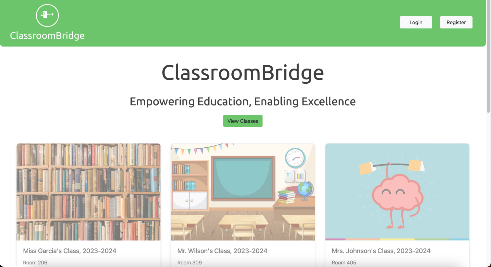
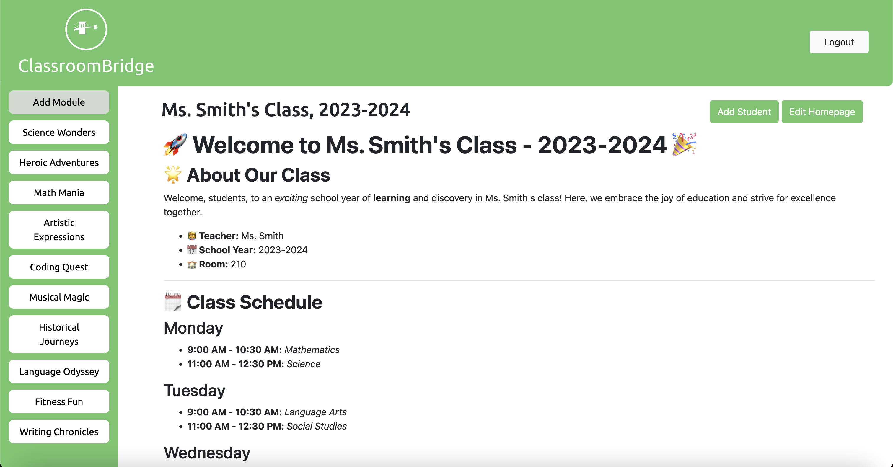

## Table of Contents
# ClassroomBridge: A Comprehensive Learning Management System

## Table of Contents

1. [Introduction](#introduction)
2. [Key Features](#key-features)
   - [Course Management](#course-management)
   - [Module Creation](#module-creation)
   - [Student Management](#student-management)
   - [User Authentication](#user-authentication)
3. [Sample](#sample)
4. [Getting Started](#getting-started)
   - [Dependencies](#dependencies)
   - [Installation](#installation)
5. [Usage](#usage)
   - [For Teachers](#for-teachers)
   - [For Students](#for-students)
6. [System Architecture](#system-architecture)
   - [Models](#models)
   - [Views](#views)
   - [Templates](#templates)
7. [API Documentation](#api-documentation)
   - [Check Login Status](#check-login-status)

## Introduction

Welcome to ClassroomBridge, a comprehensive Learning Management System (LMS) crafted for K-12 classrooms. This Django-powered app is a dynamic platform that empowers educators, students, and administrators by seamlessly integrating essential features to enhance the teaching and learning experience.

## Key Features

### Course Management
- Create and customize classes
- Organize academic subjects and extracurricular activities
- Centralized hub for all educational content

### Module Creation
- Design content-rich modules with markdown support
- Structure lessons effectively
- Share resources with students

### Student Management
- Manage student enrollment with invitation system
- Track student progress
- Foster collaborative learning environments

### User Authentication
- Secure login system with email verification
- Role-based access control (Teacher, Student, Administrator)
- Password reset functionality

## Sample



---

## Getting Started

### Dependencies
- Python 3.8+
- Django 3.2+
- Markdown2 2.4+

### Installation

1. Clone the repository:
   ```bash
   git clone https://github.com/yourusername/classroombridge.git
   ```

2. Navigate to the project directory:
   ```bash
   cd classroombridge
   ```

3. Install required dependencies:
   ```bash
   pip install -r requirements.txt
   ```

4. Set up the database:
   ```bash
   python manage.py migrate
   ```

5. Create a superuser:
   ```bash
   python manage.py createsuperuser
   ```

6. Start the development server:
   ```bash
   python manage.py runserver
   ```

## Usage

### For Teachers

1. Register for an account or log in
2. Create a new class by clicking "New Class"
3. Add modules to your class using the "Add Module" feature
4. Invite students to join your class using the "Add Student" function

### For Students

1. Register for an account or log in
2. Access course materials and complete assignments through the module view

## System Architecture

ClassroomBridge is built using the Django web framework, following the Model-View-Template (MVT) architectural pattern. Here's an overview of the main components:

### Models
- `User`: Extended Django User model
- `Class`: Represents a course or class
- `Module`: Represents a lesson or unit within a class

### Views

ClassroomBridge implements the following key views:

1. **Index View**: Renders the main landing page.
2. **Classes View**: Displays classes associated with the logged-in user.
3. **Register View**: Handles user registration with email validation.
4. **Login View**: Authenticates users and manages sessions.
5. **Logout View**: Ends user sessions securely.
6. **New Class View**: Facilitates the creation of new classes.
7. **View Class View**: Shows details of a specific class and its modules.
8. **View Module View**: Presents module content with markdown rendering.
9. **Add Module View**: Allows teachers to create new modules.
10. **Add Student View**: Manages the process of adding students to a class.
11. **Student Form View**: Renders the form for student enrollment.

### Templates

The application uses Django's template engine to render HTML dynamically. Key templates include:

- `index.html`: The landing page
- `classes.html`: Overview of user's classes
- `class.html`: Detailed view of a specific class
- `module.html`: Display for individual modules

## API Documentation

ClassroomBridge provides a simple API for checking login status:

### Check Login Status
- **URL**: `/check_login_status`
- **Method**: GET
- **Success Response**: 
  - Code: 200
  - Content: `{ "isLoggedIn": true }` or `{ "isLoggedIn": false }`
